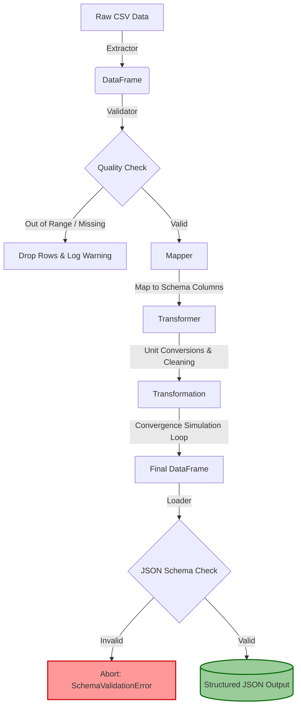

# CLEWS-OGCore Production ETL Pipeline


A production-ready, highly robust data pipeline system simulating the integration and data processing steps between typical macro-energy and economic models (like CLEWS and OG-Core).

---

## 🏗️ Architecture Overview

The pipeline executes a sequentially robust workflow driven entirely by configuration, failing fast and securely logging all discrepancies:



## ✨ Core Features

1. **Robust Configuration (`src/config.py`)**: Defines mappings, limits, ranges, and validation criteria cleanly inside `config.yaml`.
2. **Explicit Error Hierarchies (`src/exceptions.py`)**: Graceful crash tracking natively isolating `DataValidationError`, `DataExtractionError`, etc.
3. **Data Quality Fences (`src/validator.py` & `src/schema.py`)**: Ingress limits (drops bad CSV rows) and egress JSON schema tests.
4. **Dynamic Transformation (`src/transformer.py`)**: Features string normalizations, unit-of-measure conversions (MW to GW), and an iterative mathematical convergence simulation.
5. **Configurable Extractor (`src/extractor.py`)**: Seamlessly handles mapping single `.csv` targets or merging entire data directories on the fly.

## 📂 Project Structure

```text
clews-ogcore-etl-pipeline/
│
├── config.yaml             # Master configuration instructions
├── requirements.txt        # Python dependency manifest
├── main.py                 # Core CLI entry point
├── README.md               # User documentation
│
├── src/                    # Core Execution Modules
│   ├── config.py           # Configuration parser and structural validtor
│   ├── exceptions.py       # Custom ETLError routing
│   ├── extractor.py        # I/O CSV data extraction class
│   ├── validator.py        # Pre-execution limits and data constraints
│   ├── mapper.py           # Input -> Output column translation logic
│   ├── transformer.py      # Main physics and mathematical convergence simulation
│   ├── schema.py           # Output structural type checking
│   └── logger.py           # Rotating system/log persistence layer
│
├── data/                   # Input Examples
│   └── sample_input.csv    # Mock energy/economic simulation output
│
└── tests/                  # Integrity Pytests
    ├── test_validator.py
    └── test_transformer.py
```

## 🛠️ Setup Instructions

**1.** Verify Python version (3.9+). 
**2.** Initialize a virtual environment via `venv`:
   ```bash
   python -m venv venv
   source venv/bin/activate  # On Windows: venv\Scripts\activate
   ```
**3.** Install Requirements:
   ```bash
   pip install -r requirements.txt
   ```

## 💻 Usage & CLI Guide

The pipeline executes through `main.py` utilizing standard argument parsers, catching errors upstream to prevent arbitrary tracebacks.

```bash
python main.py --input data/ --output out/output.json --config config.yaml --log-level INFO
```

### Advanced Arguments
- `--input` : Target `data.csv` or a folder path like `data/`.
- `--output` : Destination path for successfully validated payload (e.g., `out/results.json`).
- `--config` : The `config.yaml` target defining variables.
- `--log-level` : Choose from `DEBUG`, `INFO`, `WARNING`, `ERROR` to manipulate the console print stream and the written `pipeline.log`.

## 🧪 Testing

The codebase includes `pytest` suites securing the fundamental computational rules inside transformations and missing-column validations.

```bash
pytest tests/
```
